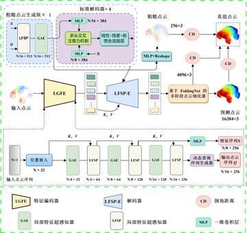

# PoinLG: Point Cloud Completion Method Based on Geometric Detail-Aware Transformer

[点云补全在ShapeNet数据集上性能排行榜](https://paperswithcode.com/sota/point-cloud-completion-on-shapenet?p=pointr-diverse-point-cloud-completion-with)

构建者： [Jin Zhang](https://github.com/mbingo224)


这个仓库是由Pytorch实现的.

PointLG 设计了有效提取局部几何特征的局部特征超感知器(Local Feature SuperPerceptron,LFSP)以及充分挖掘点云的全局形状特征的全局注意力增强器(GlobalAttention Enhancer,GAE)。PointLG 领先了许多先进的方法，在 PCN 上取得了7.51 的倒角距离(Chamfer Distance,CD)，在现实世界 KITTI上取得了 0.414 的最小匹配距离(Minimal Matching Distance, MMD)。可视化定性实验也证明了PointLG 可获得噪声更小、高度细致的几何形状的完整点云。



## 🔥进展
- **2021-10-07** Our solution based on PoinTr wins the ***Championship*** on [MVP Completion Challenge (ICCV Workshop 2021)](https://mvp-dataset.github.io/MVP/Completion.html). The code will come soon.
- **2021-09-09** Fix a bug in `datasets/PCNDataset.py`[(#27)](https://github.com/hzxie/GRNet/pull/27), and update the performance of PoinTr on PCN benchmark (CD from 8.38 to ***7.26***).

## 预训练模型

We provide pretrained PoinTr models:
| 数据集  | url| 表现 |
| --- | --- |  --- |
| ShapeNet-55 | [[Tsinghua Cloud](https://cloud.tsinghua.edu.cn/f/4a7027b83da343bb9ac9/?dl=1)] / [[Google Drive](https://drive.google.com/file/d/1WzERLlbSwzGOBybzkjBrApwyVMTG00CJ/view?usp=sharing)] / [[BaiDuYun](https://pan.baidu.com/s/1T4NqN5HQkInDTlNAX2KHbQ)] (code:erdh) | CD = 1.09e-3|
| ShapeNet-34 | [[Tsinghua Cloud](https://cloud.tsinghua.edu.cn/f/ac82414f884d445ebd54/?dl=1)] / [[Google Drive](https://drive.google.com/file/d/1Xy6wZjgJNhOYe3wDA-SbLMmGwBJ0jcBz/view?usp=sharing)] / [[BaiDuYun](https://pan.baidu.com/s/1zAxYf_9ixixqR7lvnBsRNQ)] (code:atbb ) | CD = 2.05e-3| 
| PCN |  [[Tsinghua Cloud](https://cloud.tsinghua.edu.cn/f/55b01b2990e040aa9cb0/?dl=1)] / [[Google Drive](https://drive.google.com/file/d/182xUHiUyIQhgqstFTVPoCyYyxmdiZlxq/view?usp=sharing)]  / [[BaiDuYun](https://pan.baidu.com/s/1iGenIM076akP8EgbYFBWyw)] (code:9g79) | CD = 8.38e-3|
| PCN_new |  [[Tsinghua Cloud](https://cloud.tsinghua.edu.cn/f/444d34a062354c6ead68/?dl=1)] / [[Google Drive](https://drive.google.com/file/d/1qKhPKNf6o0jWnki5d0MGXQtBbgBSDIYo/view?usp=sharing)]  / [[BaiDuYun](https://pan.baidu.com/s/1RHsGXABzz7rbcq4syhg1hA)] (code:aru3 ) |CD = 7.26e-3|
| KITTI | [[Tsinghua Cloud](https://cloud.tsinghua.edu.cn/f/734011f0b3574ab58cff/?dl=1)] / [[Google Drive](https://drive.google.com/file/d/1oPwXplvn9mR0dI9V7Xjw4RhGwrnBU4dg/view?usp=sharing)]  / [[BaiDuYun](https://pan.baidu.com/s/11FZsE7c0em2SxGVUIRYzyg)] (code:99om) | MMD = 5.04e-4 |

## 用法

### 环境依赖

- PyTorch >= 1.7.0
- python >= 3.7
- CUDA >= 9.0
- GCC >= 4.9 
- torchvision
- timm
- open3d
- tensorboardX

```
pip install -r requirements.txt
```

#### 构建Chamfer Distance, PointNet++ 和 kNN模块的 pytorch 插件
*NOTE:* PyTorch >= 1.7 and GCC >= 4.9 are required.

```
# Chamfer Distance
bash install.sh
```
安装chamfer distance模块出现的bug 可参见：PoinTr的问题 [#6](https://github.com/yuxumin/PoinTr/issues/6)
```
# PointNet++
pip install "git+git://github.com/erikwijmans/Pointnet2_PyTorch.git#egg=pointnet2_ops&subdirectory=pointnet2_ops_lib"
# GPU kNN
pip install --upgrade https://github.com/unlimblue/KNN_CUDA/releases/download/0.2/KNN_CUDA-0.2-py3-none-any.whl
```


### 数据集

所有数据集的获取与下载可参见链接： ***ShapeNet-55/34*** 和 [DATASET.md](./DATASET.md).

### 评估

在单 GPU 上使用预训练模型去评估 PoinTr 模型在所有数据集上的表现，运行以下命令：

```
bash ./scripts/test.sh <GPU_IDS>  \
    --ckpts <path> \
    --config <config> \
    --exp_name <name> \
    [--mode <easy/median/hard>]
```

####  一些测试示例:
PoinTr在 PCN 数据集基准上的测试：
```
bash ./scripts/test.sh 0 \
    --ckpts ./pretrained/PoinTr_PCN.pth \
    --config ./cfgs/PCN_models/PoinTr.yaml \
    --exp_name example
```
Test the PoinTr pretrained model on ShapeNet55 benchmark (*easy* mode):
```
bash ./scripts/test.sh 0 \
    --ckpts ./pretrained/PoinTr_ShapeNet55.pth \
    --config ./cfgs/ShapeNet55_models/PoinTr.yaml \
    --mode easy \
    --exp_name example
```
Test the PoinTr pretrained model on the KITTI benchmark:
```
bash ./scripts/test.sh 0 \
    --ckpts ./pretrained/PoinTr_KITTI.pth \
    --config ./cfgs/KITTI_models/PoinTr.yaml \
    --exp_name example
CUDA_VISIBLE_DEVICES=0 python KITTI_metric.py \
    --vis <visualization_path> 
```

### 训练

训练模型的命令行命令:

```
# 分布式训练 (DDP)
bash ./scripts/dist_train.sh <NUM_GPU> <port> \
    --config <config> \
    --exp_name <name> \
    [--resume] \
    [--start_ckpts <path>] \
    [--val_freq <int>]
# 数据分布式训练 (DP)
bash ./scripts/train.sh <GPUIDS> \
    --config <config> \
    --exp_name <name> \
    [--resume] \
    [--start_ckpts <path>] \
    [--val_freq <int>]
```
####  一些示例:
使用 2 张 GPU 在 PCN 基准数据集上训练:
```
CUDA_VISIBLE_DEVICES=0,1 bash ./scripts/dist_train.sh 2 13232 \
    --config ./cfgs/PCN_models/PoinTr.yaml \
    --exp_name example
```
恢复意外中断的模型的训练:
```
CUDA_VISIBLE_DEVICES=0,1 bash ./scripts/dist_train.sh 2 13232 \
    --config ./cfgs/PCN_models/PoinTr.yaml \
    --exp_name example --resume
```

在 PCNCars 上微调 PoinTr 模型：
```
CUDA_VISIBLE_DEVICES=0,1 bash ./scripts/dist_train.sh 2 13232 \
    --config ./cfgs/KITTI_models/PoinTr.yaml \
    --exp_name example \
    --start_ckpts ./weight.pth
```

使用单GPU训练 PoinTr 模型：
```
bash ./scripts/train.sh 0 \
    --config ./cfgs/KITTI_models/PoinTr.yaml \
    --exp_name example
```

其他对比模型的复现的训练命令，包括 GRNet、PCN、SnowflakeNet，例如在ShapeNet-55数据集上训练 GRNet，则运行如下命令：
```
CUDA_VISIBLE_DEVICES=0,1 bash ./scripts/dist_train.sh 2 13232 \
    --config ./cfgs/ShapeNet55_models/GRNet.yaml \
    --exp_name example
```

### 在 ShapeNet55 和 KITTI-Cars 数据集上的补全结果


## 许可证
MIT 许可证

## 致谢

我们的代码部分引用了 [PoinTr](https://github.com/yuxumin/PoinTr) and [mmdetection3d](https://github.com/open-mmlab/mmdetection3d).

## Citation
If you find our work useful in your research, please consider citing: 
如果你在你的研究工作有用到我们的工作，请考虑加上引用或联系我：
```
mbingo824@gmail.com
```
